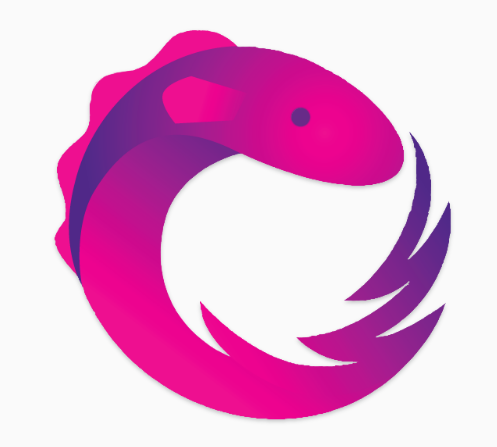

# Note Application 

## This is the backend repo for the Note Application. I created this in an course from getarrays to learn about reactive programming with rxjs.
## The backend is connected to an MySQL database and sending the data via REST to the Frontend (repo: note_application_frontend).
## You will find further information in the frontend repo. 

